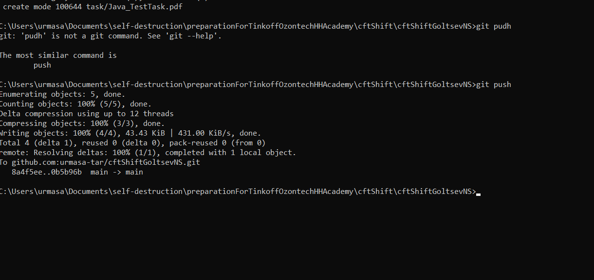

<h1>Тестовое задание Шифт CFT<h1>

<h3>Техническое задание</h3>
<h4>Утилита фильтрации содержимого файлов</h4>

Требуется написать программу, форматирующую строки входного файла, сохраняя их в другие текстовые файлы, в зависимость от типа данных

<h4>Различные формы ввода, флаги</h4>

<h4>Работа с файлами</h4>

<h3>Сборка программы</h3>
<h4>Для сборки программы с помощью Makefile</h4>
<code>make build</code>
<h4>Альтернативный вариант</h4>
<code>make build</code> 
<code>make build</code> 
<code>make build</code>
<h3>Примеры работы и запуск тестов</h3>
<h4>Для запуска программы</h4>
<code>make build</code> 
 
 
